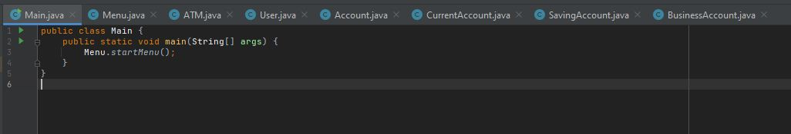
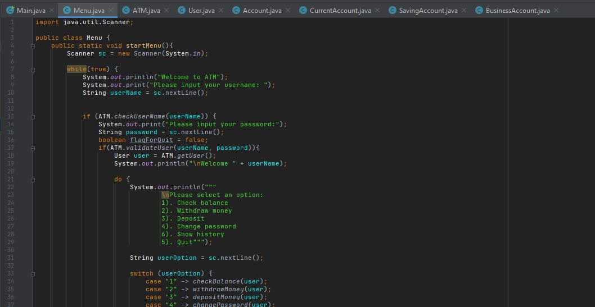
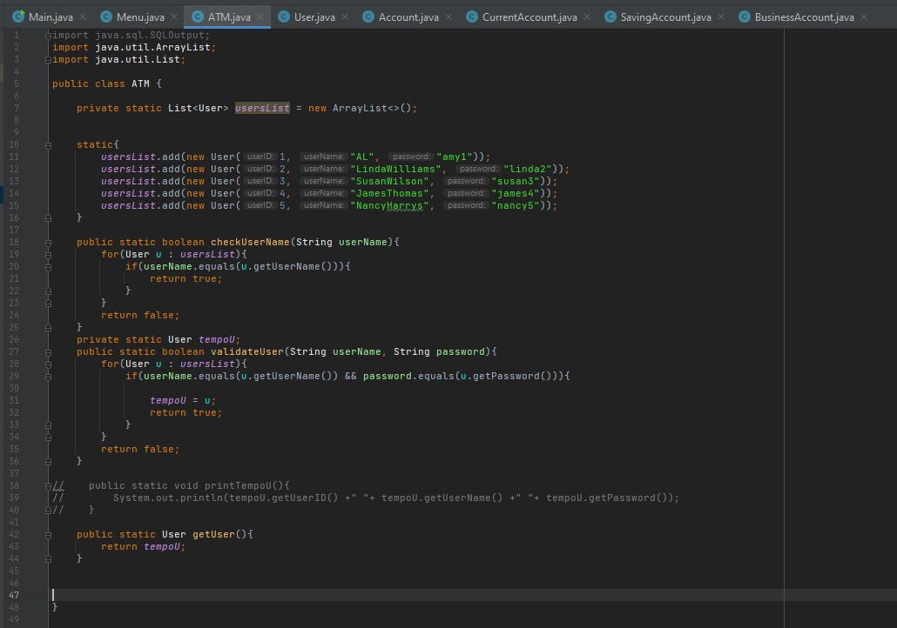
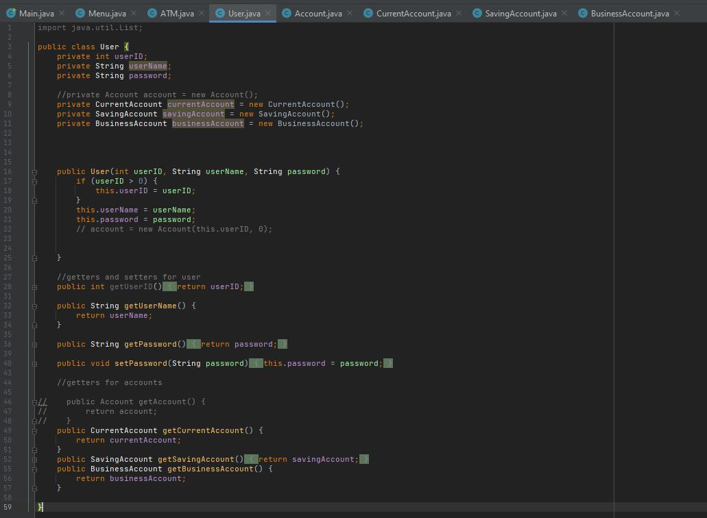
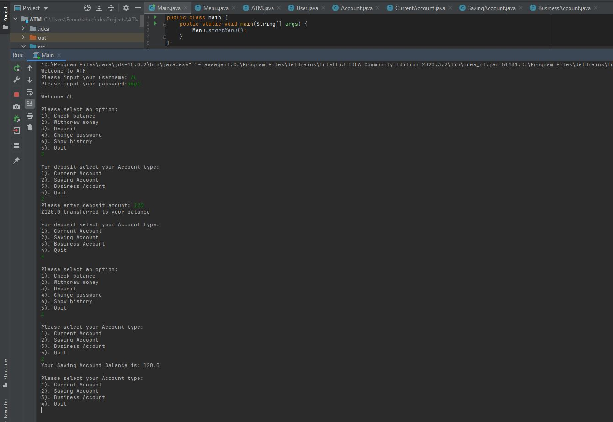

# ATM Console App (Java) — OOP & Inheritance

A Java console application that simulates an **ATM machine menu**, built using **Object-Oriented Programming (OOP)** principles and **inheritance**.

This project was created a few years ago as part of an in-class assignment during my Software Engineering degree. The goal was to mimic a real ATM flow using a menu-driven interface, multiple users, and multiple account types.

---

## Features

- Console-based ATM simulation
- Login using **username + password** (instead of a bank card/PIN)
- Multiple users pre-created in the system
- Multiple account types:
  - Current Account
  - Savings Account
  - Business Account
- Main menu options:
  - Check balance
  - Withdraw money
  - Deposit money
  - Change password
  - Quit (returns to login screen)
- Menu loops back after each operation (ATM-style)

---

## How It Works

1. User enters a **username**
2. If username exists, user is prompted for **password**
3. If credentials are valid, the ATM main menu appears
4. After each option (balance/withdraw/deposit/password), the app returns to the menu
5. Selecting **Quit** logs out and returns to the login screen

---

## Tech Used

- Java
- OOP (Encapsulation, Inheritance, Class design)
- Console UI using `Scanner`
- Simple in-memory data (users stored in a list)

---

## Project Structure (Overview)

- `Main.java` → entry point
- `Menu.java` → handles console UI and navigation
- `ATM.java` → user validation + system logic
- `User.java` → user model holding accounts
- `Account.java` → base account class (balance, deposit, withdraw)
- `CurrentAccount.java`, `SavingAccount.java`, `BusinessAccount.java` → inherited account types






---

## Running the Project

### Option 1: IntelliJ IDEA (or any other IDE)
1. Clone this repository to your local machine using Git:   
```
git clone https://github.com/YOUR_USERNAME/ATM-Java-Console.git
```   
Alternatively, you can open the GitHub repository page > Click the `Code` button > Select `Download ZIP`.   

2. Open the project in IntelliJ    

3. Run `Main.java`   


### Option 2: Terminal (basic)
Compile and run from the project root (example):
```
javac -d out src/*.java
java -cp out Main
```
